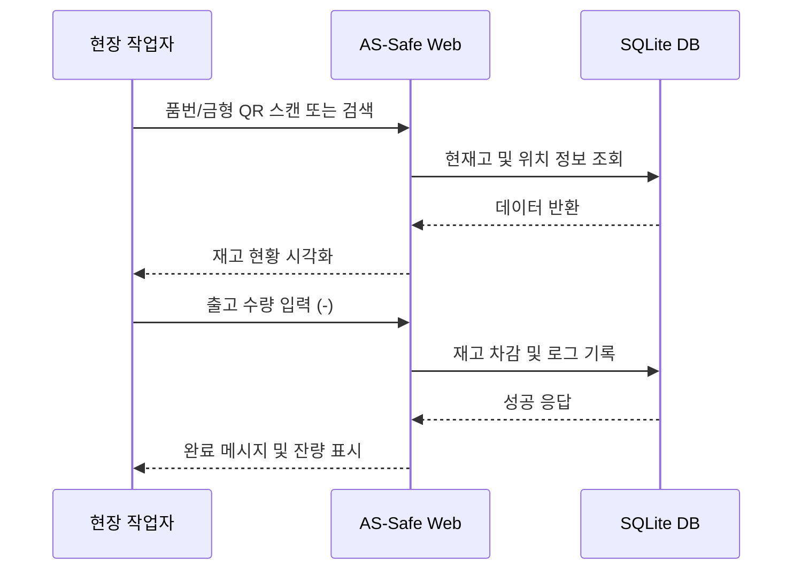

# Software Requirements Specification (SRS)
Document ID: SRS-001
Revision: 1.0
Date: 2026-04-18
Standard: ISO/IEC/IEEE 29148:2018

-------------------------------------------------

## 1. Introduction

### 1.1 Purpose
본 문서는 자동차 부품 제조사의 단산(EOL) 제품 및 AS 부품 재고 관리를 위한 'AS-Safe' 시스템의 요구사항을 정의한다. 기존 MES에 등록되지 않은 부품의 데이터를 체계화하고 재고 가시성을 확보하는 것을 목적으로 한다.

### 1.2 Scope
* **In-Scope:** - 단산 제품 기준정보 관리(품번, 금형, 위치)
    - 실시간 재고 조회 및 입출고 기록
    - 모바일 대응 웹 UI 및 생산 요청 알림 로직
* **Out-of-Scope:** - 외부 OEM 시스템과의 실시간 데이터 동기화
    - 자동 구매 발주(PO) 시스템 연동

### 1.3 Definitions, Acronyms, Abbreviations
- **EOL (End of Life):** 양산 종료 제품
- **MOQ (Minimum Order Quantity):** 최소 생산 단위
- **Bin Location:** 창고 내 물리적 보관 주소

### 1.4 References
- **REF-01:** ISO/IEC/IEEE 29148:2018 표준 가이드라인
- **REF-02:** 사내 단산 부품 관리 지침서 v1.2

---

## 2. Stakeholders
| 역할(Role) | 책임(Responsibility) | 관심사(Interest) |
| :--- | :--- | :--- |
| **현장 작업자** | 실물 입출고 데이터 입력 | 모바일 조작 편의성, 정확한 위치 정보 |
| **재고 관리자** | 기준 정보 승인 및 재고 실사 | 데이터 무결성, 장기 체화 재고 파악 |
| **생산 관리자** | AS 생산 요청 확인 및 일정 반영 | 생산 요청의 긴급도 및 금형 상태 |

---

## 3. System Context and Interfaces

### 3.1 External Systems
- **Legacy MES:** 초기 데이터 마이그레이션을 위한 엑셀 데이터 소스.

### 3.2 Client Applications
- **Web Browser:** 반응형 웹(Chrome, Mobile Safari 최적화).

### 3.4 Interaction Sequences (Core Flow)



## 4. Specific Requirements

### 4.1 Functional Requirements

| ID | SOURCE | Functional Requirement Description | Priority |
| :--- | :--- | :--- | :--- |
| **REQ-FUNC-001** | User Story | 부분 일치 검색 기능을 제공해야 한다. | Must |
| **REQ-FUNC-002** | User Story | 창고 내 번지 정보를 수정할 수 있어야 한다. | Must |

---

## 5. Appendix

### 5.1 Interaction Sequence

```mermaid
sequenceDiagram
    Worker->>System: 품번 검색
    System->>DB: 조회
    DB-->>System: 결과
    System-->>Worker: 재고 표시

